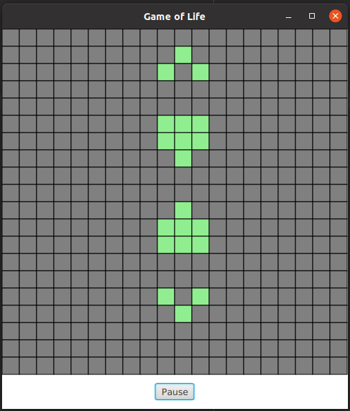

# Kotlin Game of Life
Game of Life project written in Kotlin using JavaFX for graphics.  
When tha game is paused you can click cells to change their state to alive/dead, then start the simulation.

JavaFX is not part of of the Java SDK and JRE since Java 8. If you're trying to build the project with Java 11 or higher you should download the JavaFX SDK first.  
It's available here: https://gluonhq.com/products/javafx/  
(I recommend a stable version like 17.0.2 [LTS])

